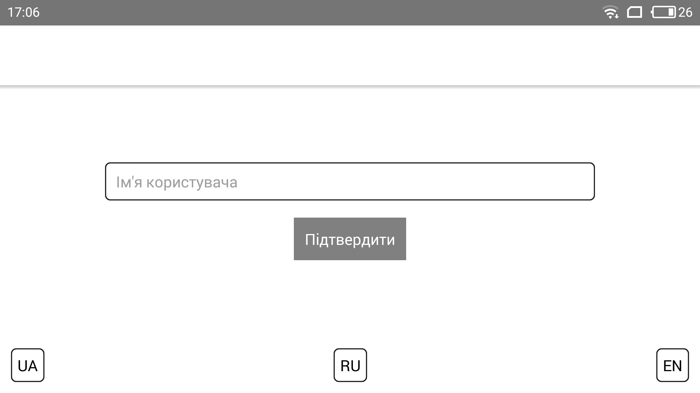
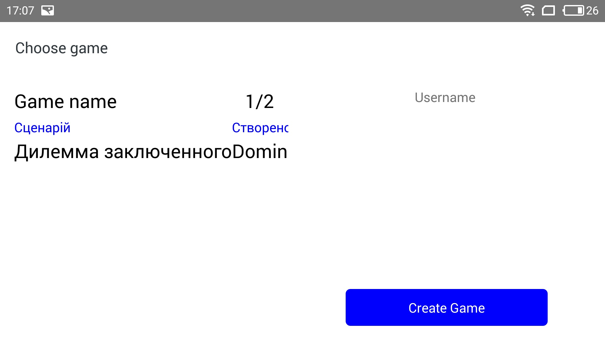
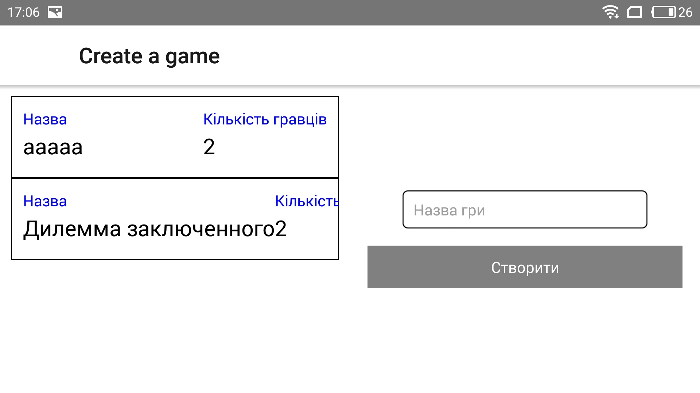
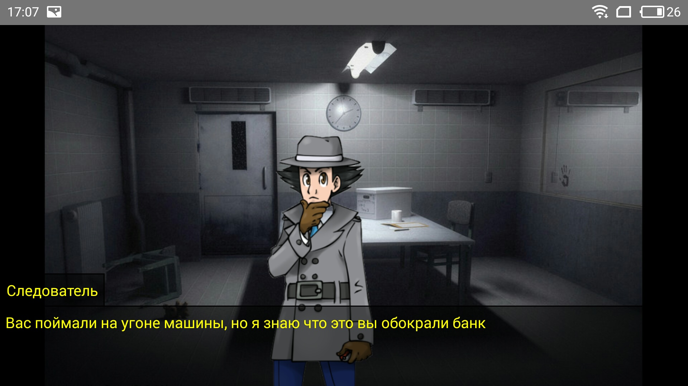
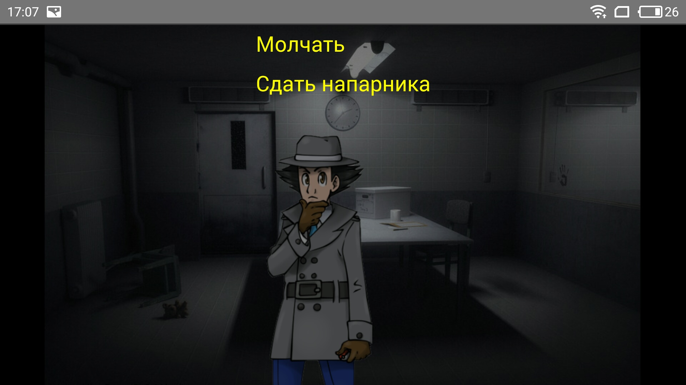
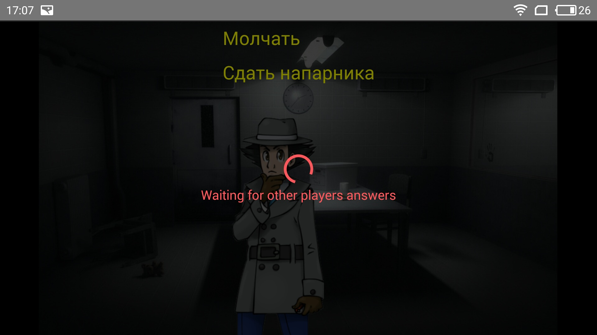
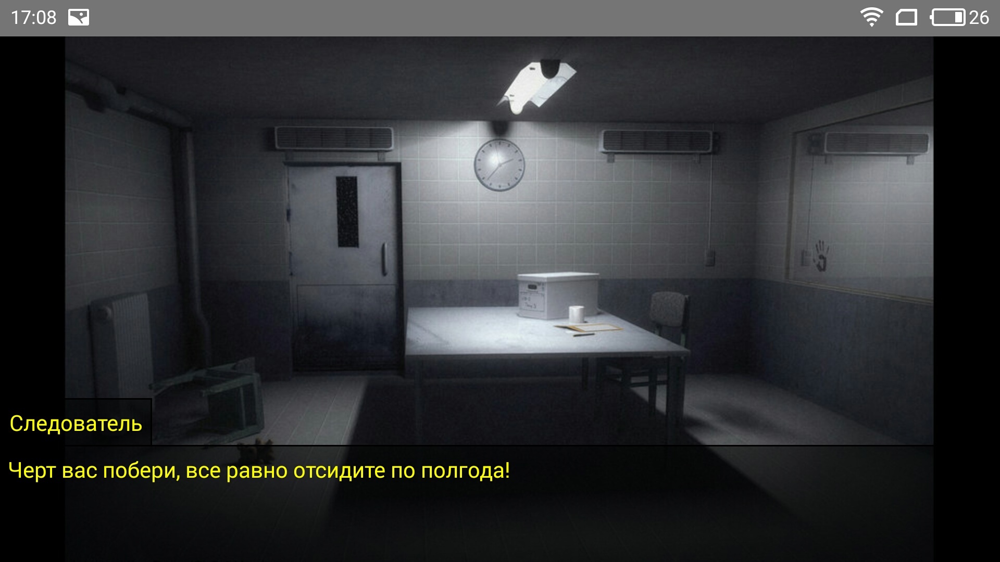

# Дилема заключенных

## Скриншоты игры

### Экран регистрации


### Список игр


### Экран создания игры


### Пример сцены игры


### Экран выбора


### Спиннер во время ожидания ответов других игроков


### Результат игры


## Описание игры

```JSON
{
    "Name": "Дилемма заключенного", // Название игры
    "PlayersCount": 2, // Количество игроков
    "StartSceneId": 1, // ID начальной сцены из Scenes
    "ImageResources": [ // Список изображений
        {
          "Id": 1, // Уникальный идентификатор изображения
          "Path": "/images/Interrogation_Room.jpg" // Относительный путь к изображению
        }, 
        { "Id": 2, "Path": "/images/inspector.png" }
    ],
    "Scenes": // Список сцен
      [{
            "Id": 1, // Уникальный идентификатор сцены
            "BackgroundId": 1, // ID фонового изображения из ImageResources
            "Text": "Следователь|Вас поймали на угоне машины, но я знаю что это вы обокрали банк|Следователь|Твой дружок уже во всю дает против тебя показания - тебе светит 10 лет. Но мы ведь знаем, что ты не виноват|Следователь|Давай так - ты сдаешь подельника, а мы тебя отпускаем. Что скажешь?", // Список реплик в сцене, разделенных символом |; строится по принципу `"Имя героя|Реплика"`
            "Type": "Normal", // Тип сцены - Normal/Result 
            "WaitForOthers": true, // флаг, показывающий, что игрок должен дождаться ответа всех игроков перед переходом на следующую сцену
            "Sprites": [ // Список спрайтов (изображения персонажей)
                { 
                  "ResourceId": 2, // ID изображения из ImageResources
                  "PositionX": 30, // Отступ от левого края экрана в %
                  "PositionY": 30  // Отступ от верхнего края экрана в %
                }
            ],
            "Chooser": { // Описание решения игры
                "Choices": [ // Список возможных выборов игрока
                    {
                      "Id": 1, // Уникальный идентификатор выбора
                      "Caption": "Молчать" // Заглавие
                    },
                    { "Id": 2, "Caption": "Сдать напарника" }
                ],
                "ChoiceMatrix": [ // Матрица игры
                    {
                      "MatrixPosition": "1-1", // Выбор текущего игрока-Выбор оппонента
                      "NextSceneId": 2, // ID следующей сцены для текущего игрока
                      "Value": 1 // Очки; временно не используется
                    },
                    { "MatrixPosition": "1-2", "NextSceneId": 3, "Value": 1 },
                    { "MatrixPosition": "2-1", "NextSceneId": 4, "Value": 1 },
                    { "MatrixPosition": "2-2", "NextSceneId": 5, "Value": 1 }
                ]
            }
        },
        {
            "Id": 2,
            "BackgroundId": 1,
            "Text": "Следователь|Черт вас побери, все равно отсидите по полгода!",
            "Type": "Result",
        },
        {
            "Id": 3,
            "BackgroundId": 1,
            "Text": "Следователь|Я же тебе говорил! Вот твой подельничек сдал тебя и гуляет теперь на свободе, а тебе теперь 10 лет светит.",
            "Type": "Result",
        },
        {
            "Id": 4,
            "BackgroundId": 1,
            "Text": "Следователь|Вот и молодец! Иди гуляй, пока мы твоего подельничка на 10 лет оформляем.",
            "Type": "Result",
        },
        {
            "Id": 5,
            "BackgroundId": 1,
            "Text": "Следователь|Два болвана сдали друг друга, как и предполагалось. Вот и славно, следующие 2 года вам будет о чем подумать.",
            "Type": "Result",
        }
    ]
}
```